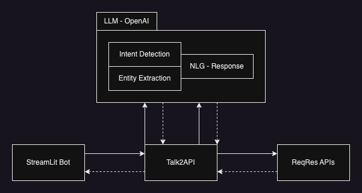

# Talk2API
This project demonstrates the execution of APIs using queries typed in natural language

## What we did?
In this project we are going to Talk to the [ReqRes](https://reqres.in/) APIs using plain english language. Also, convert the responses back into human readiable english language

## Why we did?
This project is done to explore the possibility of applying latest AI progress in NLP in creating domain driven, goal oriented chat bots with a flexibility of even going out of domain if required.

## How we did?

## Getting started with development

### Pre-requisites

[Anaconda Installation](https://docs.conda.io/projects/conda/en/latest/user-guide/install/index.html)

> conda create --name talk2api python

> conda activate talk2api

> git clone https://github.com/sheikirfanbasha/Talk2API.git

> cd Talk2API

> pip install -r requirements.txt

> export OPENAI_API_KEY=<your_openai_api_key>

> streamlit run talk2api