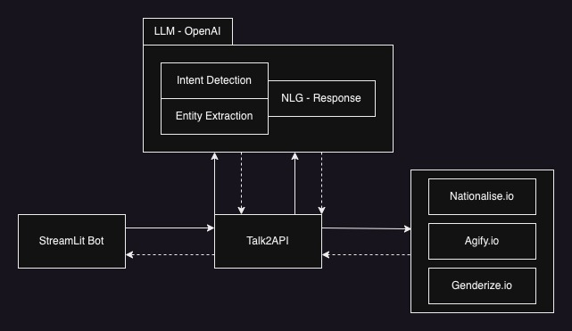

# Talk2API
This project demonstrates the execution of APIs using queries typed in natural language

## What we did?
In this project we are going to Talk to the [Genderize.io](https://genderize.io/), [Nationalize.io](https://nationalize.io/) and [Agify.io](https://agify.io/) APIs using plain english language. Also, convert the responses back into human readiable english language

## Why we did?
This project is done to explore the possibility of applying latest AI progress in NLP in creating domain driven, goal oriented chat bots with a flexibility of even going out of domain if required.

## How we did?

### High Level Design



### Approach

Thinking in Langchain framework:

* An agent driven by 3 tools.
* Tools detect the intent of the user
* Each tool will be using the extraction chain to extract the necessary information and call its respective API
* Once the response is got from the respective API, separate prompts are constructed to generate a natural response

#### MileStone-1
Get the bot fully functional with the planned talk2API agent capable of using all the three tools and answer the user queries in a natural language style


**Result**


## Getting started with development

### Pre-requisites

[Anaconda Installation](https://docs.conda.io/projects/conda/en/latest/user-guide/install/index.html)

> conda create --name talk2api python

> conda activate talk2api

### Setup, Build and Run

> git clone https://github.com/sheikirfanbasha/Talk2API.git

> cd Talk2API

> pip install -r requirements.txt

> export OPENAI_API_KEY=<your_openai_api_key>

> streamlit run talk2api

### Known Issues and Fixes

| Error      | Fix |
| ----------- | ----------- |
| ModuleNotFoundError: No module named 'langchain.chat_models'   | pip install langchain --upgrade        |


## Useful for stepwise understanding

### Extraction of Entities

> python experiments/extractEntities.py

Input

```
Alex is 5 feet tall. Claudia is 1 feet taller Alex and jumps higher than him. Claudia is a brunette and Alex is blonde.
```
Output

```
[{'name': 'Alex', 'height': 5, 'hair_color': 'blonde'}, {'name': 'Claudia', 'height': 6, 'hair_color': 'brunette'}]
```

### Genderize Tool

> python tools/genderizeTool.py

Input

```
What can be the gender of  Michael?
```

Extraction Chain Output

```
[{'name': "Michael"}]
```

Raw API output

```
{"count":1094417,"name":"Michael","gender":"male","probability":1.0}
```

Final NLG output

```
The name is Michael and it is a male name. The probability of it being a male name is 1.0.
```

### Nationalise Tool

> python tools/nationaliseTool.py

Input

```
What can be the nationality of  Michael?
```

Extraction Chain Output

```
[{'name': "Michael"}]
```

Raw API output

```
{"count":2101006,"name":"michael","country":[{"country_id":"AT","probability":0.061},{"country_id":"DE","probability":0.056},{"country_id":"DK","probability":0.054},{"country_id":"IE","probability":0.048},{"country_id":"GH","probability":0.046}]}
```

Final NLG output

```
The name is Michael and there are a total of 2,101,006 occurrences of this name. The name is most likely associated with the following countries and their respective probabilities: Austria (0.061), Germany (0.056), Denmark (0.054), Ireland (0.048), and Ghana (0.046).
```

### Agify Tool

> python tools/agifyTool.py

Input

```
What is the age of Michael?
```

Raw API output

```
{"count":298219,"name":"michael","age":62}
```

Final output

```
Michael is 62 years old.
```

### Talk2API Agent

> python agent.py

Input

```
What can be the nationality of  Michael?
```

Output

